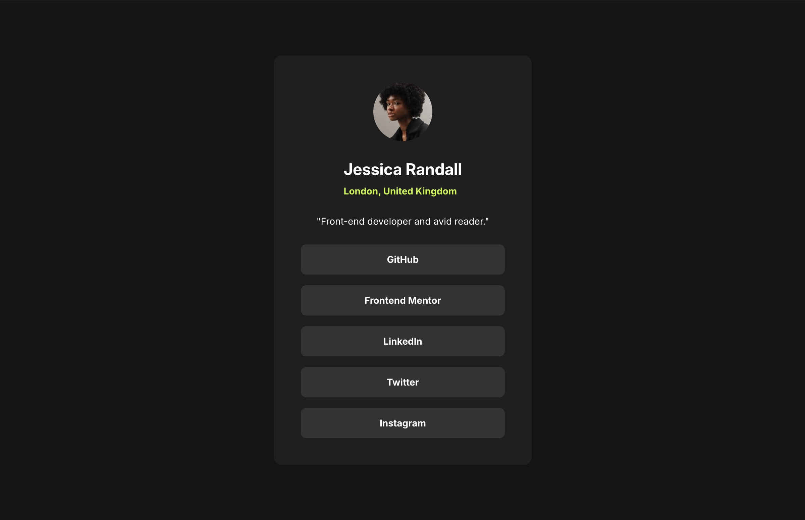

# Frontend Mentor - Social links profile solution

This is a solution to the [Social links profile challenge on Frontend Mentor](https://www.frontendmentor.io/challenges/social-links-profile-UG32l9m6dQ).
Frontend Mentor challenges help improve frontend skills by building realistic UI components.

## Table of contents

- [Overview](#overview)
  - [Preview](#screenshot)
  - [Links](#links)
- [Features](#features)
- [My process](#my-process)
  - [Built with](#built-with)
  - [What I learned](#what-i-learned)
- [Setup](#setup)
  - [Installation](#installation)
  - [Development](#development)
  - [Build](#build)
  - [Linting](#linting)
- [Deployment](#deployment)
- [Performance](#performance)
- [Author](#author)
- [Notes](#notes)

## Overview

### The challenge

Users should be able to:

- See hover and focus states for all interactive elements

### Preview



### Links

- Solution URL: [GitHub Repo](https://github.com/vlrnsnk/social-links-profile)
- Live Site URL: [Live Site](https://vlrnsnk.github.io/social-links-profile/)

## Features
- Responsive layout (mobile-first)
- Accessible interactive states (hover + focus-visible)
- SCSS modular architecture
- CSS property ordering enforced via Stylelint
- Optimized build with Vite
- GitHub Pages deployment

## My process

### Built with

- Semantic HTML5 markup
- SCSS (modular architecture: abstracts, base, components, layout)
- CSS custom properties (design tokens via SCSS variables)
- Flexbox
- Mobile-first workflow
- Vite
- Stylelint (code quality + property ordering)
- GitHub Pages (deployment)

### What I learned

- Better SCSS architecture using `@use` and modular structure instead of legacy global scope patterns
- Creating reusable mixins for typography and transitions
- Enforcing consistent CSS property order via `stylelint-order`
- Improving accessibility (focus-visible states, semantic HTML, reduced motion support)
- Handling Vite + GitHub Pages deployment base path correctly

Example transition mixin usage:

```scss
@include abstracts.transition(background-color, color);
```

## Setup

### Installation
```bash
npm install
```

### Development
```bash
npm run dev
```

### Build
```bash
npm run build
npm run preview
```

### Linting
```bash
npm run lint
```
This project uses Stylelint + EditorConfig + Husky pre-commit hooks
to ensure consistent code formatting before commits.

### Fix SCSS issues:
```bash
npm run lint:fix
```

## Deployment
Build is generated via Vite and deployed to GitHub Pages using GitHub Actions.

## Performance

Lighthouse score: 100/100 across all categories

- Performance: 100
- Accessibility: 100
- Best Practices: 100
- SEO: 100

## Author
- Website: https://vlrnsnk.com
- Frontend Mentor: https://www.frontendmentor.io/profile/vlrnsnk
- GitHub: https://github.com/vlrnsnk

## Notes

Focus was placed on SCSS architecture, consistent styling conventions, and accessibility-first implementation.

Key decisions:
- Modular SCSS using `@use`
- Strict Stylelint property ordering
- Accessibility via semantic HTML and focus-visible states
- Vite base path configuration for GitHub Pages
